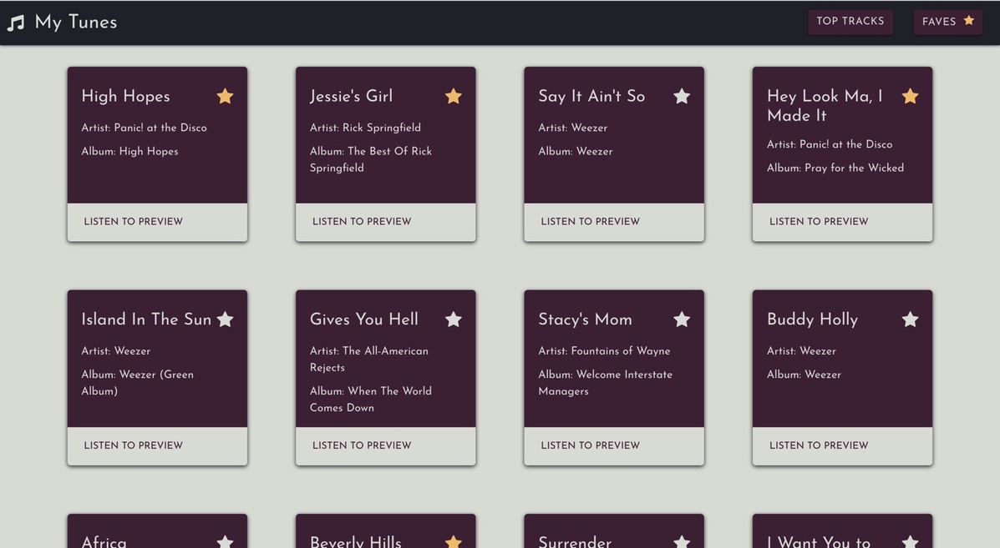
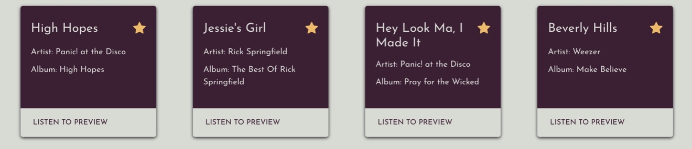

# My Tunes
This project displays a list of songs. A user can browse through the songs and listen to previews. The user can click on the favorite icon to add a song to a favorite list. The user can click the favorite tab and view only their favorited songs. To take on song off the favorite list, a user only has to uncheck the favorite icon.

## Motivation
To experiment with React props and the Napster API

## Deployment

Netlify - https://favorite-tracks.netlify.app/

## Code Style
React- JSX style

## Screenshots



## Tech/Framework used

React.js with functional components

## Features

* Preivew songs
* Save your favorite songs by clicking of favorite start icon
* Favorite icon will turn a different color
* Use of local storage
* Favorite page to view all favorite songs
* Remove a song from favorite list by clicking on the favorite icon again


## API Reference

[Napster API](https://developer.napster.com/api/v2.2)

## Code Example 
Use of Napster API, setting state, and localStorage
```
  const[tracks, setTracks] = useState(() => {
    const result = localStorage.getItem('tracks')
    return result? JSON.parse(result): []
  })
  const [isLoading, setIsLoading] = useState(true)

  useEffect(() => {
    const callAPI = () => {
      fetch("https://api.napster.com/v2.2/genres/g.397/tracks/top?limit=100&apikey=NmFmMTU4M2YtOTA4Mi00YzAzLWEyZDUtNTczMTYwMmNjZGFk")
      .then(res => res.json())
      .then(json => {
        console.log(json)
        json.tracks.map((track, index)=>{
          if(tracks.length === 0){
            setTracks(tracks => [...tracks, {name: track.name, artistName: track.artistName, albumName: track.albumName, previewURL: track.previewURL, fav: false}])
          }
        })
      })
      }
      callAPI()
    }, [])
```

## License

© My Tunes
